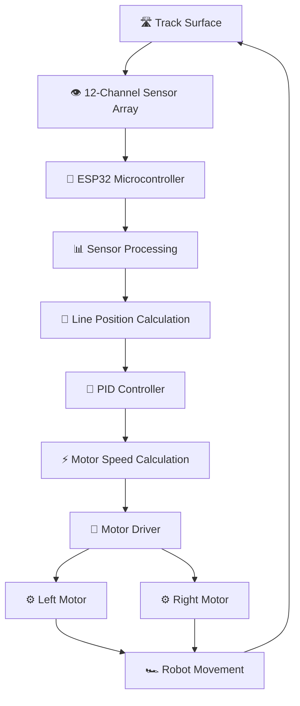
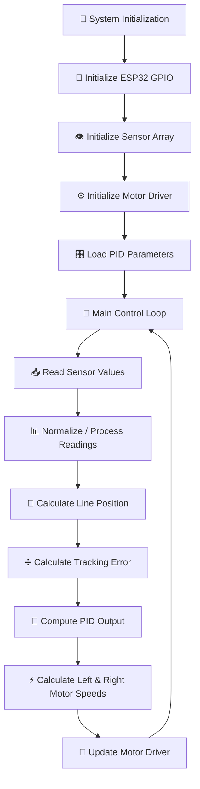

# 🏎️ Fast-Line-Follower-Robot-TechnoXian

### ⚡ High-Speed Autonomous Line Following Robot for TechnoXian

**Built for Speed. Engineered for Precision. Designed to Dominate the Track.**

  
  
  
  

---

### 🏁 An autonomous, high-speed line-following robot designed to navigate tracks with precision using a 12-channel infrared sensor array, an ESP32 microcontroller, and a PID-based motor control system.

---

# 📖 Table of Contents

* [🌟 About the Project](#-about-the-project)
* [✨ Key Features](#-key-features)
* [🏗️ System Architecture](#️-system-architecture)
* [🔩 Hardware Components](#-hardware-components)
* [🧠 Software Architecture](#-software-architecture)
* [🎯 PID Control System](#-pid-control-system)
* [⚙️ Working Principle](#️-working-principle)
* [🔌 Hardware Connections](#-hardware-connections)
* [📂 Project Structure](#-project-structure)
* [🚀 Getting Started](#-getting-started)
* [🧪 Calibration & Tuning](#-calibration--tuning)
* [🏎️ Performance Optimization](#️-performance-optimization)
* [🛠️ Troubleshooting](#️-troubleshooting)
* [🔮 Future Improvements](#-future-improvements)
* [👨‍💻 Team & Credits](#-team--credits)

---

# 🌟 About the Project

The **Fast Line Follower Robot** is an autonomous robotic platform developed for **TechnoXian**, designed to follow a predefined track at high speed while maintaining stability and accuracy.

The robot uses a **12-channel sensor array from Robo Junkies** to continuously detect the position of a track relative to the robot.

An **ESP32 microcontroller** processes the sensor readings and executes a PID-based control algorithm to calculate the correction required to keep the robot aligned with the track.

The correction is then translated into independent motor commands through a motor driver, allowing the robot to adjust its direction dynamically.

With **600 RPM motors**, a multi-sensor tracking system, and real-time feedback control, the robot is designed to achieve fast and responsive line following.

### 🎯 Project Objectives

* 🏎️ Achieve high-speed autonomous line following.
* 🎯 Maintain accurate track alignment.
* ⚡ Minimize unnecessary oscillations and overshooting.
* 🧠 Implement real-time PID-based steering correction.
* 🔄 Respond dynamically to curves and track deviations.
* 🏁 Develop a reliable platform for competitive robotics.

---

# ✨ Key Features

| Feature              | Description                                    |
| -------------------- | ---------------------------------------------- |
| 🧠 Microcontroller   | ESP32                                          |
| 👁️ Sensor System    | 12-channel sensor array by Robo Junkies        |
| ⚙️ Motor System      | 600 RPM DC motors                              |
| 🎮 Control Algorithm | PID (Proportional–Integral–Derivative)         |
| 🔌 Motor Control     | Dual-motor differential steering               |
| 🏎️ Navigation       | Autonomous line tracking                       |
| ⚡ Processing         | Real-time sensor feedback and motor correction |
| 🏁 Application       | TechnoXian line-following competition          |

---

# 🏗️ System Architecture

The robot is built around a feedback-control architecture in which the sensor system continuously measures the robot's position relative to the track.

The ESP32 processes this information, calculates the steering correction using PID, and sends the appropriate commands to the motor driver.

## 🔄 High-Level Architecture

### 🧩 Architecture Breakdown

**1️⃣ Sensor Layer — Track Detection**

The 12-channel sensor array detects the contrast between the track and the surrounding surface.

It provides multiple sensing points across the front of the robot, allowing the controller to estimate the line's position relative to the robot's center.

**2️⃣ Processing Layer — ESP32**

The ESP32 acts as the central processing unit.

Its responsibilities include:

* Reading sensor data.
* Processing the sensor values.
* Estimating the line position.
* Calculating the PID correction.
* Generating motor control signals.

**3️⃣ Control Layer — PID Algorithm**

The PID controller calculates the difference between the desired line position and the measured position.

It uses this error to generate a steering correction that helps the robot remain aligned with the track.

**4️⃣ Actuation Layer — Motor Driver**

The motor driver receives the control signals from the ESP32 and regulates the power delivered to the motors.

The left and right motors are controlled independently to produce differential steering.

**5️⃣ Mechanical Layer — Robot Chassis**

The chassis supports the electronics, sensor array, motors, wheels, and power system.

Its design influences the robot's stability, traction, and ability to navigate curves.

---

# 🔩 Hardware Components

## 🧰 Bill of Materials (BOM)

| S. No. | Component          | Specification                        | Purpose                           |
| ------ | ------------------ | ------------------------------------ | --------------------------------- |
| 1      | 🧠 Microcontroller | ESP32                                | Main processing and control       |
| 2      | 👁️ Sensor Array   | 12-channel Robo Junkies array        | Line detection                    |
| 3      | ⚙️ DC Motors       | 600 RPM                              | Robot propulsion                  |
| 4      | 🔌 Motor Driver    | Model to be confirmed                | Motor speed and direction control |
| 5      | 🛞 Wheels          | Model to be confirmed                | Traction and movement             |
| 6      | 🏗️ Chassis        | Model to be confirmed                | Mechanical support                |
| 7      | 🔋 Battery         | Voltage and capacity to be confirmed | Power supply                      |
| 8      | 🔗 Wiring          | Suitable connectors and wires        | Electrical connections            |

> ⚠️ The exact motor driver, battery, wheel specifications, and sensor-array interface need to be confirmed before finalizing the hardware documentation.

---

# 🧠 Software Architecture

The firmware is organized around a continuous feedback loop.

Each iteration reads the sensor array, determines the line's position, calculates the PID output, and updates the motor commands.

## 🔄 Software Pipeline

## 📌 Core Software Modules

| Module            | Responsibility                        |
| ----------------- | ------------------------------------- |
| `SensorManager`   | Reads and processes sensor data       |
| `LinePosition`    | Estimates the line's position         |
| `PIDController`   | Calculates steering correction        |
| `MotorController` | Controls motor speed and direction    |
| `Main Loop`       | Coordinates the control cycle         |
| `Calibration`     | Handles sensor calibration and tuning |

*These are conceptual modules; the actual firmware may use different names or a single source file.*

---

# 🎯 PID Control System

The robot uses a **PID (Proportional–Integral–Derivative) controller** to calculate steering corrections based on the line-tracking error.

PID combines three control terms:

### 🔴 1. Proportional (P)

The proportional term responds to the current tracking error.

A larger error produces a stronger correction.

$$
P = K_p \times e(t)
$$

### 🟢 2. Integral (I)

The integral term accumulates the error over time.

It can help compensate for persistent tracking deviations.

$$
I = K_i \times \int e(t)\,dt
$$

### 🔵 3. Derivative (D)

The derivative term responds to how quickly the error changes.

It can help reduce oscillations and improve the stability of the co
